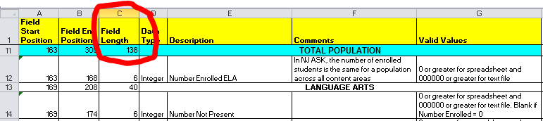
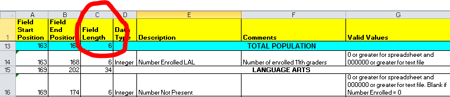

Title: Errata: prepping the HSPA, GEPA, and old NJASK layout files
Date: 2015-04-16
Category: education
Tags: boring, errata
Status: hidden
Slug: hspa-layout
Author: Andrew Martin

```{r, echo=FALSE}
#SET THIS TO TRUE WHEN READY TO PUBLISH
ready_to_ship = FALSE

library(knitr)
hook_plot <- knit_hooks$get('plot')

knit_hooks$set(plot=function(x, options) {
    if (!is.null(options$pelican.publish) && options$pelican.publish) {
        x <- paste0("{filename}", x)
    }
    hook_plot(x, options)
})
opts_chunk$set(dev='Cairo_svg')
opts_chunk$set(pelican.publish=ready_to_ship)

if (ready_to_ship) {
  final_path = '../'
} else {
  final_path = ''
}

```

<!-- PELICAN_END_SUMMARY -->
**Attention conservaton notice:** this post is just data munging to get a csv with HSPA metadata shipshape.  Tried to set it to `status: hidden` so it wouldn't show on the front page of the blog, but had some trouble with Pelican.  That said, work has to get done, so better to do it in an .Rmd and write down what I was thinking - I've learned that lesson like a thousand times.  If you are in the small group of people who care about this sort of thing, [get in touch]('mailto:almartin at gmail dot com').

First, read in the csv.  This proved to be kind of a headache:

the format of the HSPA file layout is totally different from the NJASK file (sigh).  The key difference is that the  spanning headers that indicate the subgroup (gen ed, special ed, etc) are indicated as have start/end position across the whole relevant range in the NJASK file, but on the HSPA file they only show up as 6 character fields _before_ the relevant range.  I hand-edited the HSPA file so it would be consistent with the NJASK file.  

**NJASK:**



**HSPA:**



This.... I can't say anything nice about the decision to do this (_why?!?_) so I'm just going to move on.  

```{r hspa1}

hspa <- readr::read_csv(paste0(final_path, "datasets/hspa_layout.csv"))
names(hspa) <- tolower(gsub(' ', '_', names(hspa)))

head(hspa)

```

Let's rework the code from the first [post]({filename}/04_njask-data-1.Rmd) into a proper function.

```{r libraries, message=FALSE, warning=FALSE}
library(sqldf)
library(magrittr)
library(dplyr)
library(reshape2)
```

```{r hspa2}

process_layout <- function(df) {
  require(sqldf)
  require(magrittr)
  require(dplyr)
  require(reshape2)  
  
  #split spanners from keepers
  spanners <- dplyr::filter(df, structural==TRUE)
  keepers <- dplyr::filter(df, structural==FALSE)
  
  #join spanners to keepers
  with_spanners <- sqldf('
    SELECT keepers.*
          ,spanners.data_type AS spanner
          ,spanners.field_length AS spanner_length
    FROM keepers
    LEFT OUTER JOIN spanners
      ON keepers.field_start_position >= spanners.field_start_position
     AND keepers.field_end_position <= spanners.field_end_position
  ')

  #tag the joined data frame with a row number to facilitate long -> wide
  with_rn <- with_spanners %>%
    dplyr::group_by(
       field_start_position, field_end_position, field_length, 
       data_type, description, comments, valid_values  
    ) %>%
    mutate(
      rn = order(desc(spanner_length)) 
    ) %>%
    select(
      field_start_position, field_end_position, field_length, 
      data_type, description, comments, valid_values, spanner, rn
    ) %>%
    as.data.frame()

  #text processing and mask NAs
  with_rn$rn <- paste0('spanner', with_rn$rn)
  with_rn$spanner <- ifelse(is.na(with_rn$spanner),'', with_rn$spanner)

  layout_wide <- dcast(
    data = with_rn,
    formula = field_start_position + field_end_position + field_length +
      data_type + description + comments + valid_values ~ rn,
    value.var = "spanner"
  )
  
  #this appears to be a bug in dcast?  should not be needed.
  layout_wide$spanner2 <- ifelse(is.na(layout_wide$spanner2),'', layout_wide$spanner2)

  reserved_chars <- list('+' = 'and', '(' = '', ')' = '')
  for (i in 1:length(reserved_chars)) {
    layout_wide$spanner1 <- gsub(
      names(reserved_chars)[i], 
      reserved_chars[i], 
      layout_wide$spanner1, 
      fixed = TRUE
    )
  }
  
  #make final name
  layout_wide$final_name <- layout_wide %$% paste(spanner1, spanner2, description, sep='_')

  #kill double underscores
  layout_wide$final_name <- gsub('__', '_', layout_wide$final_name)
  #kill leading or trailer underscores
  layout_wide$final_name <- gsub("(^_+|_+$)", "", layout_wide$final_name)
  #trim any remaining whitespace
  layout_wide$final_name <- gsub("^\\s+|\\s+$", "", layout_wide$final_name)
  #all whitespace becomes underscore
  layout_wide$final_name <- gsub(' ', '_', layout_wide$final_name)
  
  #more whitespace cleanup
  layout_wide$comments <- gsub("^\\s+|\\s+$", "", layout_wide$comments)
  layout_wide$description <- gsub("^\\s+|\\s+$", "", layout_wide$description)
  layout_wide$valid_values <- gsub("^\\s+|\\s+$", "", layout_wide$valid_values)
  
  return(layout_wide)
}

layout_hspa <- process_layout(hspa)

layout_hspa %>% head()

```

Finally, save the hspa layout as an .rda file.

```{r save_layout}

save(layout_hspa, file = paste0(final_path,'datasets/hspa_layout.rda'))

```

# old HSPA

Before 2010 the HSPA used a different layout.  Prep that layout file:

Read:

```{r old_hspa1}

hspa2010 <- readr::read_csv(paste0(final_path, "datasets/hspa2010_layout.csv"))
names(hspa2010) <- tolower(gsub(' ', '_', names(hspa2010)))

head(hspa2010)

```

One note here: the layout at flat file has headers for science, even though it isn't on the HSPA.  I'm omitting the last set of science headers in my layout file, because the raw files on the state website don't appear to be padded with enough blanks for the last NA slots.  

Process:
```{r old_hspa2}

layout_hspa2010 <- process_layout(hspa2010)

layout_hspa2010 %>% head()

```

Save:
```{r old_hspa3}

save(layout_hspa2010, file = paste0(final_path, 'datasets/hspa2010_layout.rda'))

```

# GEPA

Now do the same for the GEPA layout, using the functions developed above:

Read:
```{r gepa1}

gepa <- readr::read_csv(paste0(final_path, 'datasets/gepa_layout.csv'))
names(gepa) <- tolower(gsub(' ', '_', names(gepa)))

head(gepa)

```

Process:
```{r gepa2}

layout_gepa <- process_layout(gepa)

layout_gepa %>% head()

```

Save:
```{r gepa3}

save(layout_gepa, file = paste0(final_path, 'datasets/gepa_layout.rda'))

```

# old NJASK

repeat for old NJASK

Read:
```{r oldnjask1}

njask05 <- readr::read_csv(paste0(final_path, 'datasets/njask2005_layout.csv'))
names(njask05) <- tolower(gsub(' ', '_', names(njask05)))

head(njask05)

```

Process:
```{r oldnjask2}

layout_njask05 <- process_layout(njask05)

layout_njask05 %>% head()
layout_njask05 %>% tail()

```

Save:
```{r oldnjask3}

save(layout_njask05, file = paste0(final_path, 'datasets/njask05_layout.rda'))

```

# (2004) old NJASK

once more for 2004 NJASK

Read:
```{r njask041}

njask04 <- readr::read_csv(paste0(final_path, 'datasets/njask2004_layout.csv'))
names(njask04) <- tolower(gsub(' ', '_', names(njask04)))

head(njask04)

```

Process:
```{r njask042}

layout_njask04 <- process_layout(njask04)

layout_njask04 %>% head()
layout_njask04 %>% tail()

```

Save:
```{r njask043}

save(layout_njask04, file = paste0(final_path, 'datasets/njask04_layout.rda'))

```


# 2007 gr 3 NJASK

this one used a slightly different layout.

Read:
```{r njask07_1}

njask07gr3 <- readr::read_csv(paste0(final_path, 'datasets/njask2007gr3_layout.csv'))
names(njask07gr3) <- tolower(gsub(' ', '_', names(njask07gr3)))

head(njask07gr3)

```

Process:
```{r njask07_2}

layout_njask07gr3 <- process_layout(njask07gr3)

layout_njask07gr3 %>% head()
layout_njask07gr3 %>% tail()

```

Save:
```{r njask07_3}

save(layout_njask07gr3, file = paste0(final_path, 'datasets/njask07gr3_layout.rda'))

```


# 2006 gr 3 NJASK

sooooo many little changes to these layouts.

Read:
```{r njask06_1}

njask06gr3 <- readr::read_csv(paste0(final_path, 'datasets/njask2006gr3_layout.csv'))
names(njask06gr3) <- tolower(gsub(' ', '_', names(njask06gr3)))

head(njask06gr3)

```

Process:
```{r njask06_2}

layout_njask06gr3 <- process_layout(njask06gr3)

layout_njask06gr3 %>% head()
layout_njask06gr3 %>% tail()

```

Save:
```{r njask06_3}

save(layout_njask06gr3, file = paste0(final_path, 'datasets/njask06gr3_layout.rda'))

```


# 2006 gr 5 NJASK

sigh.

Read:
```{r njask06gr5_1}

njask06gr5 <- readr::read_csv(paste0(final_path, 'datasets/njask2006gr5_layout.csv'))
names(njask06gr5) <- tolower(gsub(' ', '_', names(njask06gr5)))

head(njask06gr5)

```

Process:
```{r njask06gr5_2}

layout_njask06gr5 <- process_layout(njask06gr5)

layout_njask06gr5 %>% head()
layout_njask06gr5 %>% tail()

```

Save:
```{r njask06gr5_3}

save(layout_njask06gr5, file = paste0(final_path, 'datasets/njask06gr5_layout.rda'))

```

# 2009 NJASK

Read:
```{r njask09_1}

njask09 <- readr::read_csv(paste0(final_path, 'datasets/njask2009_layout.csv'))
names(njask09) <- tolower(gsub(' ', '_', names(njask09)))

head(njask09)

```

Process:
```{r njask09_2}

layout_njask09 <- process_layout(njask09)

layout_njask09 %>% head()
layout_njask09 %>% tail()

```


Save:
```{r njask09_3}

save(layout_njask09, file = paste0(final_path, 'datasets/njask09_layout.rda'))

```

